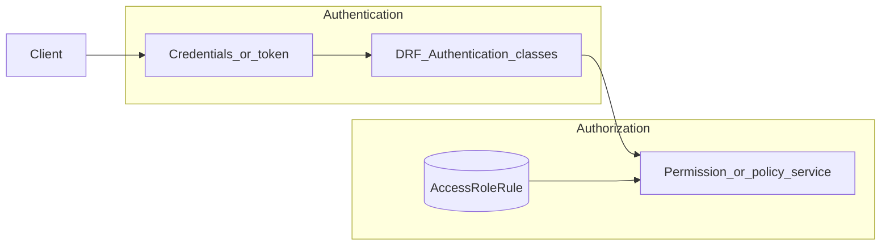

# Отчёт: проверка соответствия [task.md](task.md)

**Дата:** 2026-04-19  
**Артефакты:** [README.md](README.md), [db.md](db.md), [backend/users/models.py](backend/users/models.py), [backend/api/](backend/api/), [backend/users_backend/settings.py](backend/users_backend/settings.py)

---

## Краткое резюме


| Блок ТЗ                                                                               | Оценка                               | Комментарий                                                                                                                                                                                |
| ------------------------------------------------------------------------------------- | ------------------------------------ | ------------------------------------------------------------------------------------------------------------------------------------------------------------------------------------------ |
| §1 Пользователь (регистрация, профиль, soft-delete, login/logout, идентификация)      | **Не выполнено / не демонстрируемо** | Конфигурация Djoser/DRF отключена; корневой URL не подключает API; во [views](backend/api/views.py) ошибка синтаксиса и импортов — модуль пользователей не загружается при обычном импорте |
| §2 Авторизация (описание схемы, таблицы, тестовые данные, 401/403, API админа правил) | **Частично (модели есть)**           | Таблицы и админка Django есть; полное текстовое описание и сиды отсутствуют; правила не связаны с mock/API                                                                                 |
| §3 Mock-бизнес объекты                                                                | **Частично**                         | Mock views есть; проверка по `AccessRoleRule` не реализована; маршрут заказа без `pk` не соответствует сигнатуре view                                                                      |


**Итог:** архитектурная задумка (RBAC-модели) соответствует формулировке ТЗ, но интеграционный слой и конфигурация находятся в состоянии, не позволяющем считать задание выполненным без исправлений из раздела «TODO».

---

## Матрица трассировки требований


| ID       | Требование из task.md                                           | Где искать в проекте                                                                                                                                           | Статус                                                   |
| -------- | --------------------------------------------------------------- | -------------------------------------------------------------------------------------------------------------------------------------------------------------- | -------------------------------------------------------- |
| **1.1**  | Регистрация: ФИО, email, пароль, повтор пароля                  | Djoser при включении даёт типичный контракт; явных кастомных serializers регистрации под ТЗ нет                                                                | Не подтверждено                                          |
| **1.2**  | Обновление профиля                                              | Задумано через Djoser `UserViewSet`; `UserSerializer` только read-only поля для профиля                                                                        | Не подтверждено                                          |
| **1.3**  | Мягкое удаление: logout, `is_active=False`, нельзя залогиниться | Поле `is_active` в модели есть; отдельного сценария/API под soft-delete в коде не найдено                                                                      | Не реализовано                                           |
| **1.4**  | Login по email и паролю                                         | `USERNAME_FIELD = "email"` в [User](backend/users/models.py); Djoser `LOGIN_FIELD` в settings закомментирован                                                  | Не подтверждено                                          |
| **1.5**  | Logout                                                          | `djoser.urls.authtoken` при подключении                                                                                                                        | Не подтверждено                                          |
| **1.6**  | После login — идентификация на последующих запросах             | Требуется `TokenAuthentication` (или JWT) в `REST_FRAMEWORK`; сейчас закомментировано                                                                          | Не выполнено                                             |
| **2.1**  | Текстовое описание схемы прав в README или файле                | [db.md](db.md) — черновик; [README.md](README.md) не описывает RBAC                                                                                            | Неполно                                                  |
| **2.2**  | Таблицы в БД                                                    | `Role`, `BusinessElement`, `AccessRoleRule` в [users/models.py](backend/users/models.py), миграция [0001_initial.py](backend/users/migrations/0001_initial.py) | Выполнено                                                |
| **2.3**  | Тестовые данные для демонстрации                                | Фикстуры / data migration не обнаружены                                                                                                                        | Не выполнено                                             |
| **2.4**  | 401 если пользователь не определён; 403 если нет права          | Mock используют только `IsAuthenticated` (нет проверки правил); типичное поведение DRF для анонима при `IsAuthenticated` — ожидаемо 401                        | Не по ТЗ                                                 |
| **2.5**  | API для получения/изменения правил — только администратор       | Нет ViewSet/serializers для `AccessRoleRule`; только [Django admin](backend/users/admin.py)                                                                    | Не выполнено (API)                                       |
| **3.1**  | Mock-views без таблиц бизнеса                                   | [mock_views.py](backend/api/mock_views.py)                                                                                                                     | Частично (см. баг URL)                                   |
| **Hint** | bcrypt для паролей                                              | Стандартные хешеры Django (PBKDF2); bcrypt в зависимостях не указан                                                                                            | Не выполнено                                             |
| **Hint** | JWT для токена                                                  | В [requirements.txt](backend/requirements.txt) есть `djangorestframework_simplejwt` и `PyJWT`, в settings не подключено                                        | Не используется                                          |
| **Hint** | Кастомный middleware и `request.user`                           | Стандартный `AuthenticationMiddleware`; отдельного JWT-middleware нет                                                                                          | Стандартный путь DRF предпочтительнее middleware для API |


---

## Что сделано хорошо

1. **Модель RBAC близка к ТЗ:** `Role` с кодами admin/manager/user/guest, `BusinessElement`, `AccessRoleRule` с набором булевых `*_permission` и `UniqueConstraint(role, element)` — предсказуемая схема для правил доступа.
2. **Пользователь:** email как логин, явные ФИО и отчество, связь с ролью через FK на `Role.code`, `PROTECT` при удалении роли для пользователей — осмысленные ограничения целостности.
3. **Инфраструктура:** Django 6 + DRF + PostgreSQL в [settings.py](backend/users_backend/settings.py), разделение приложений `users` и `api`.
4. **Админка:** удобное редактирование ролей, элементов и правил в [users/admin.py](backend/users/admin.py) — полезно для разработки (но не заменяет REST API админа из ТЗ).

---

## Пробелы и риски (приоритеты)

### P0 — блокируют работу и демонстрацию


| Проблема                       | Детали                                                                                                                                                                                                  |
| ------------------------------ | ------------------------------------------------------------------------------------------------------------------------------------------------------------------------------------------------------- |
| Корневой роутинг               | [users_backend/urls.py](backend/users_backend/urls.py) не включает `api.urls` — HTTP API проекта недоступен с корня приложения                                                                          |
| Имя view и импорт              | [api/urls.py](backend/api/urls.py) регистрирует `UserViewSet`, в [api/views.py](backend/api/views.py) объявлен только `UsersViewSet` — `ImportError` при загрузке роутера                               |
| Синтаксис и импорты во views   | Пустой `from django.db.models import (` … `)` вызывает **SyntaxError**; импорт `backend.api.services` при запуске из каталога `backend` часто не резолвится — использовать `from api.services import …` |
| Djoser отключён                | В `INSTALLED_APPS` закомментирован `'djoser'`, при этом views/serializers/url завязаны на Djoser                                                                                                        |
| REST_FRAMEWORK закомментирован | Нет `TokenAuthentication` по умолчанию — выдача токена из README не будет работать как задумано                                                                                                         |
| Mock заказ                     | URL `demo/order/` без `<pk>`, метод `get(self, request, pk)` — несовместимо; переименование `MockOrkerDetailView` — опечатка                                                                            |


### P1 — соответствие ТЗ по функционалу


| Проблема                           | Детали                                                                                                                                                                                                    |
| ---------------------------------- | --------------------------------------------------------------------------------------------------------------------------------------------------------------------------------------------------------- |
| Нет сидов для RBAC                 | Требование «таблицы заполнены тестовыми данными» не выполнено                                                                                                                                             |
| Нет REST API для правил            | Только Django Admin; нужен защищённый endpoint для администратора                                                                                                                                         |
| Авторизация не связана с БД правил | [mock_views.py](backend/api/mock_views.py): `allowed = True`; [permissions.py](backend/api/permissions.py): `IsHavePermissionOrReadOnly` ссылается на `obj.author`, у mock и типовых моделей ТЗ этого нет |
| Soft-delete аккаунта               | Нет явной реализации «удаление → logout → is_active=False»                                                                                                                                                |


### P2 — качество и безопасность конфигурации


| Проблема                                     | Детали                                                                                                        |
| -------------------------------------------- | ------------------------------------------------------------------------------------------------------------- |
| Переменные окружения                         | Опечатки `SESECRET_KEY`, `ALLOWWRD_HOSTS` — легко получить `SECRET_KEY=None` и сломанный деплой               |
| [serializers.py](backend/api/serializers.py) | Мусорный импорт `urllib3.request`; inconsistent `backend.users.models` vs `users.models`                      |
| Документация                                 | [README.md](README.md): опечатки, неверный путь `docker-compose-yml`, незаполненный раздел наполнения данными |


---

## Архитектура: аутентификация и авторизация

### Целевое разделение (как должно быть по ТЗ)




**Вердикт:** модель данных для авторизации заложена; **слой проверки прав по `AccessRoleRule` отсутствует** в HTTP-слое. Аутентификация задумана через Djoser + Token, но настройки не активированы — **разделение authn/authz на практике не доведено**.

Рекомендация senior-уровня: вынести проверку в один сервис (например `users/services/access.py`) и вызывать его из `BasePermission` или mixin для mock и будущих ресурсов — без дублирования условий в каждой view.

---

## TODO: пошаговый план с примерами кода

Цель — закрыть [task.md](task.md) с опорой на уже созданные модели.

### Шаг 1. Восстановить работоспособность роутинга и конфигурации

1. Исправить [api/views.py](backend/api/views.py): удалить пустой импорт из `django.db.models`; заменить `from backend.api.services` на `from api.services import build_absolute_file_url`.
2. В [api/urls.py](backend/api/urls.py): импортировать `UsersViewSet` (или переименовать класс в `UserViewSet` — главное, **одно имя**).
3. В [users_backend/urls.py](backend/users_backend/urls.py): добавить префикс API, например:

```python
from django.urls import include, path

urlpatterns = [
    path("admin/", admin.site.urls),
    path("api/", include("api.urls")),
]
```

1. В [settings.py](backend/users_backend/settings.py): раскомментировать и поправить `djoser`, `REST_FRAMEWORK` с `TokenAuthentication`; исправить имена переменных `SECRET_KEY`, `ALLOWED_HOSTS` в `os.getenv(...)`.
2. Исправить [serializers.py](backend/api/serializers.py): удалить `from urllib3 import request`; единообразно `from users.models import User`.

### Шаг 2. Тестовые данные (fixtures или data migration)

Пример фрагмента data-migration (идемпотентно через `get_or_create`):

```python
# Псевдокод внутри RunPython
Role.objects.get_or_create(code="admin", defaults={"name": "Администратор"})
Role.objects.get_or_create(code="guest", defaults={"name": "Гость"})
book_el, _ = BusinessElement.objects.get_or_create(code="book", defaults={"name": "Книги"})
AccessRoleRule.objects.update_or_create(
    role_id="guest",
    element=book_el,
    defaults={"read_permission": True, "read_all_permission": False},
)
```

### Шаг 3. Сервис проверки доступа

```python
# users/services/access.py (новый модуль)
from users.models import AccessRoleRule, Role

def user_has_element_access(user, element_code: str, action: str, *, owner_id: int | None) -> bool:
    if not user.is_authenticated:
        return False
    try:
        rule = AccessRoleRule.objects.select_related("element").get(
            role_id=user.role_id,
            element__code=element_code,
        )
    except AccessRoleRule.DoesNotExist:
        return False
    # action: read | create | update | delete; сравнить owner_id для *_all vs без _all
    ...
```

Маппинг HTTP-метода и «свой/чужой» объект — в одном месте (таблица или dict), чтобы mock и админ API использовали ту же логику.

### Шаг 4. Mock views: 401 / 403 по правилам

- Оставить **401** для неаутентифицированных (`IsAuthenticated` / отсутствие токена).
- Для аутентифицированных вызывать сервис; при отказе — **403** с `{"detail": "..."}`.

Пример:

```python
def get(self, request):
    if not user_has_element_access(request.user, "book", "read", owner_id=None):
        return Response({"detail": "Forbidden"}, status=403)
    return Response(...)
```

Исправить маршрут заказа: `path("order/<int:pk>/", ...)`.

### Шаг 5. REST API для правил (администратор)

- ViewSet на `AccessRoleRule` с `Serializer` и `permission_classes`, где доступ разрешён только если `request.user.role_id == Role.Codes.ADMIN` (или отдельная проверка через `AccessRoleRule` для элемента «управление правилами», если такой код заведён в `BusinessElement`).
- Использовать `select_related("role", "element")` и пагинацию при списке.

### Шаг 6. Soft-delete аккаунта (если не покрывает Djoser)

Кастомный action `POST /api/users/me/delete/` или переопределение `perform_destroy`: установить `user.is_active = False`, вызвать `logout`/удаление токена, вернуть 204.

### Шаг 7. Тесты и регрессия

См. следующий раздел.

---

## Регрессия и минимальная автоматизация

Рекомендуемый **минимальный бар** перед merge:


| Команда / артефакт                                                | Назначение                                                                                                                                                  |
| ----------------------------------------------------------------- | ----------------------------------------------------------------------------------------------------------------------------------------------------------- |
| `python manage.py check`                                          | Системные проверки Django (уже проходит даже при сломанном `api.views`, т.к. модуль не импортируется до запроса — после починки добавить smoke-импорт в CI) |
| `python manage.py makemigrations --check`                         | Нет забытых миграций                                                                                                                                        |
| Импорт API в CI: `python -c "import django; …; import api.views"` | Ловит SyntaxError/ImportError в views                                                                                                                       |
| `pytest` + `pytest-django`                                        | Кейсы: аноним → mock → 401; пользователь без правила → 403; с правилом → 200; админ меняет правило                                                          |
| `flake8` (в venv из [requirements.txt](backend/requirements.txt)) | Статический стиль и очевидные ошибки                                                                                                                        |


Пример скелета теста API:

```python
import pytest
from rest_framework.test import APIClient

@pytest.mark.django_db
def test_demo_books_forbidden_without_auth():
    client = APIClient()
    resp = client.get("/api/demo/books/")
    assert resp.status_code == 401
```

Путь префикса `/api/` учитывать после исправления корневого `urls.py`.

---

## Как перепроверить вручную (после исправлений)

1. Поднять PostgreSQL и backend ([docker-compose.yml](docker-compose.yml)), задать корректный `.env` (`SECRET_KEY`, `POSTGRES_*`, `DB_HOST`).
2. `migrate`, загрузить фикстуры/миграцию данных.
3. Зарегистрироваться → получить токен → `Authorization: Token …` на `GET /api/demo/books/` и сценарии 403.
4. Под пользователем с ролью admin — CRUD правил через новый API.

---

*Конец отчёта.*